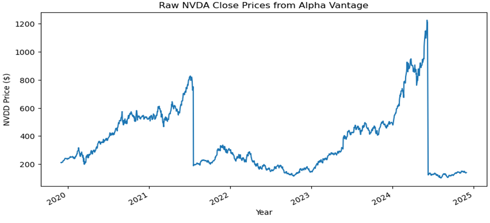
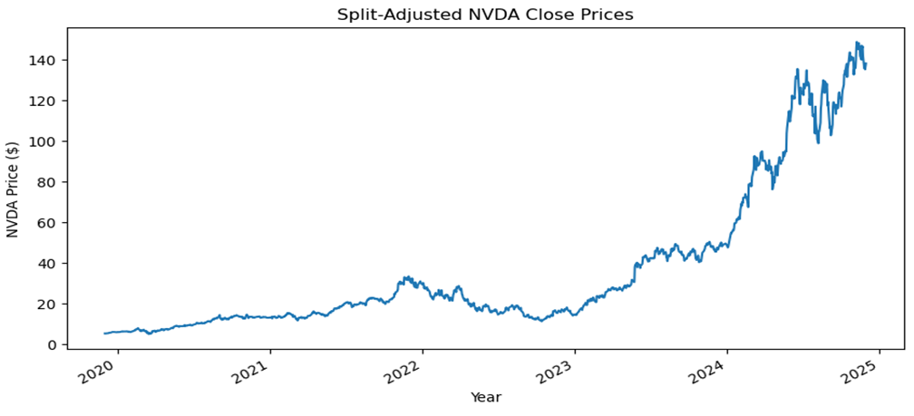
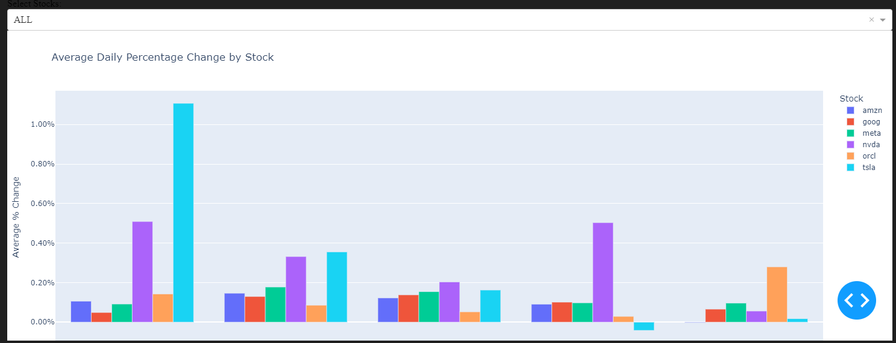
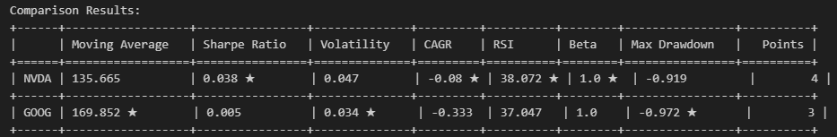

# AI Stock Insights

<details>
  <summary><strong>Table of Contents</strong></summary>
  
  - [About This Project](#about-this-project)
  - [Libraries Used](#libraries-used)
  - [API Used](#api-used)
  - [Stock Splits and Data Adjustments](#stock-splits-and-data-adjustments)
  - [Visualization Examples](#visualization-examples)
  - [Contributors](#contributors)

</details>

## About This Project

This project is designed to analyze and measure the historical performance of various stocks, focusing on key metrics such as percent change and adjusted close prices. By utilizing real-time stock data and adjusting for stock splits, the project allows for in-depth analysis and visualization of stock trends over time. The data is processed and visualized to provide insights into stock performance, helping users understand fluctuations and trends for companies like Amazon, Google, Tesla, and more.

## Libraries Used

- `hvplot` For interactive plotting of stock trends and percent changes.
- `pandas` For data manipulation and analysis.
- `requests` For making HTTP requests to external APIs.
- `matplotlib` For static plotting of data.
- `numpy` For numerical operations and calculations.
- `panel` For creating interactive dashboards and visualizations.
- `dash` For building web-based interactive visualizations and dashboards.


To install:

```
pip install hvplot pandas requests matplotlib numpy panel dash
```

## API Used

- **Alpha Vantage API**: We used the [Alpha Vantage API](https://www.alphavantage.co/documentation/) to retrieve historical stock data for analysis.

## Stock Splits and Data Adjustments

When analyzing stock data, we noticed anomalies such as sharp drop-offs in certain graphs. These discrepancies were due to stock splits, where companies increase the number of shares while reducing the price proportionally. To ensure accurate visualizations, we developed a function to adjust for these splits, resulting in split-adjusted prices for consistency in analysis.

Below are the graphs illustrating the stock prices before and after applying our stock split adjustments:

### Before Adjustments


### After Adjustments


With these adjustments in place, we generated the following visualizations to highlight key trends and insights.

## Visualization Examples

Here are some visualizations and insights from our stock analysis:

### 1. Cumulative Percent Change of All Stocks


This graph illustrates the cumulative percent change of all analyzed stocks over the selected time period.

### 2. Average Daily Percent Change of All Stocks



This visualization highlights the average daily percent change for each stock.

### 3. Comparison Results Table



This table summarizes key metrics, enabling a comparison of performance across all stocks.

<p align="right">(<a href="#table-of-contents">back to top</a>)</p>


## Contributors

Check out the list of contributors to this project [here](https://github.com/srourdanny/stock_analysis/graphs/contributors).

